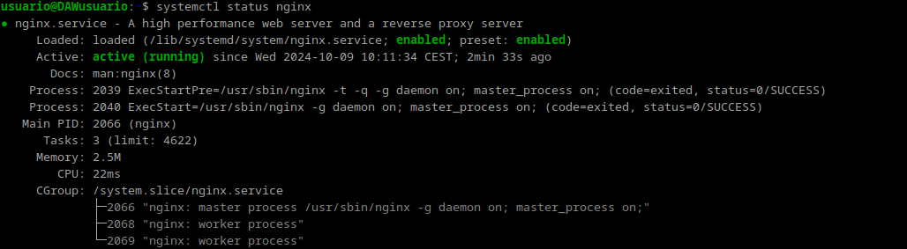
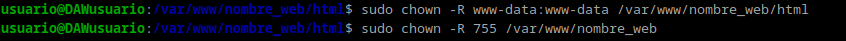
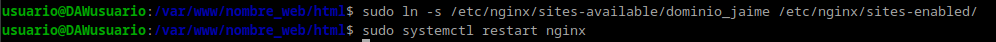

## Practica 2

# Ejercicio 2 de Despileges
## Intalacion de Nginx
Para empezar la intalación pondremos en la terminal de comandos de nuestra maquina de Debian 12 el siguiente comando para actualizar los repositorios y otro para instalar nginx:
```
	sudo apt update
	sudo apt install nginx
```
Una vez intalado para ver si la instalacion se ha hecho correctamente escribiremos:
` systemctl status nginx`



### Creacion de una carpeta para el sitio Web
Todos los archivos que nginx necesita para formar un sitio web se organizara en carpetas. Esta carpeta estara ubicada  normalmente en `/var/www`.
Para crear esta carpeta usaremos `mkdir`:
```
	sudo mkdir -p /var/www/nombre_web/html 
```
En nuestro caso `nombre_web` podra ser el nombre del dominio que nosotros queramos.
Ahora dentro de la carpeta html deberemos clonar el repositorio: `https://github.com/cloudacademy/static-website-example`.
Aparte de eso cambiaremos los derechos sobre la carpeta para que el propietario sea `www-data` que normalmente es el usuario típico del servicio web. Con el siguiente comando y le daremos los permisos para que no haya errores:
```
	sudo  chown  -R  www-data:www-data  /var/www/nombre_web/html
```
```
	sudo  chmod  -R  755  /var/www/nombre_web
```


Ahora para ver si el servidor funciona podréis acceder correctamente desde vuestro cliente con ` http://ip-maq-virtual`.
### Configuración de servidor web NGINX
En Nginx hay dos rutas importantes. La primera de ellas es `sites-available`, que contiene los archivos de configuración de los hosts virtuales. La otra es `sites-enabled`, que contiene los archivos de configuración de los sitios habilitados, es decir, los que funcionan en ese momento.
Dentro de `sites-available` hay un archivo llamado `default`  que es la pagina por defecto que se muestra en el servidor.
Para que NGINX nos presente el contenido de nuestra web, es necesario crear un bloque de servidor. En vez de modificar el archivo `default` para ello creamos `/etc/nginx/sites-available/nombre_web` con el siguiente comando:
```
	sudo nano /etc/nginx/sites-available/vuestro_dominio
```
Y el contenido de dicho archivo sera:


Y crearemos un archivo simbólico entre este archivo y el de sitios que están habilitados, para que se dé de alta automáticamente y después reiniciaremos el servidor para aplicar la configuración:



## Comprobaciones
### Comprobación del correcto funcionamiento
Como todavia no disponemos de DNS que traduzca nuestras IPs, deberemos hacerlo manualmente. Para ello vamos a editar el archivo `/etc/hosts`  **de nuestra máquina anfitriona** para que asocie la IP de la maquina a nuestro `nombre_web`.

En Linux el archivo que hay que editar es el antes mencionado pero en Windows es `C:\Windows\System32\drivers\etc\hosts`.
A este archivo hay que añardirle esta linea:
`X.X.X.X nombre_web`
donde X.X.X.X es la IP de la maquina virtual.


### Comprobar registros del servidor

Para comprobar que las peticiones se están registrando correctamente en los archivos de logs, tanto las correctas como las erróneas:
```
/var/log/nginx/access.log

/var/log/nginx/error.log
```
Esto lo encotraremos en la maquina virtual.